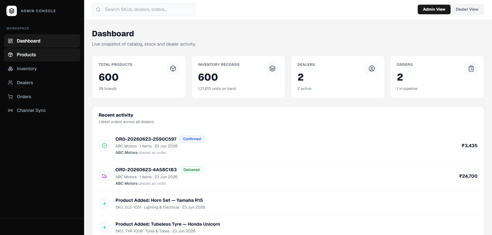
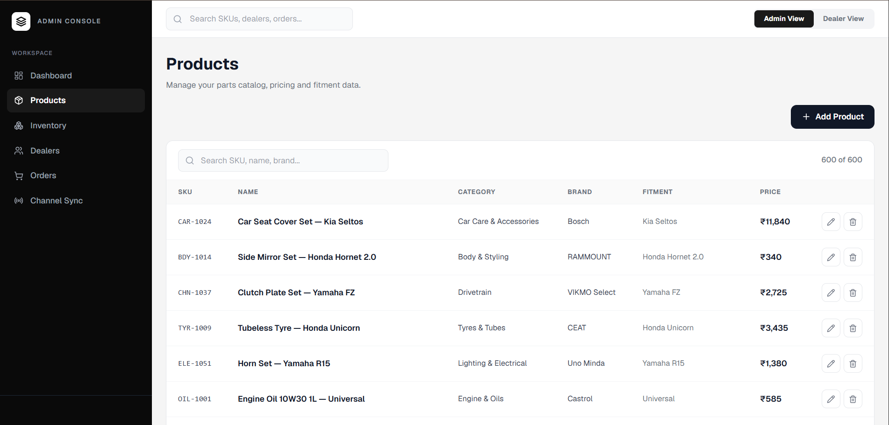
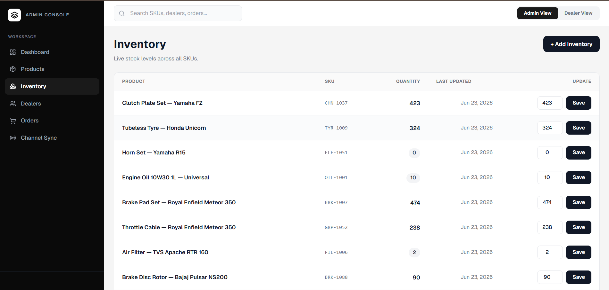
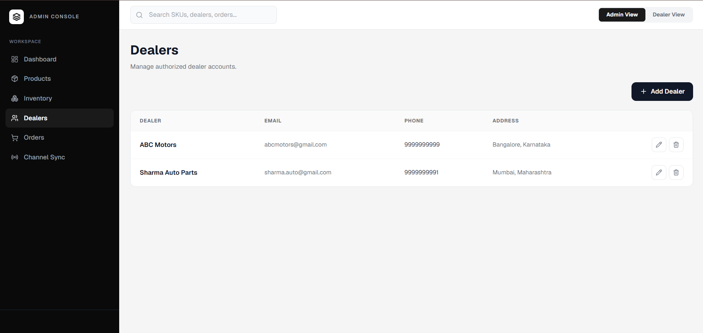
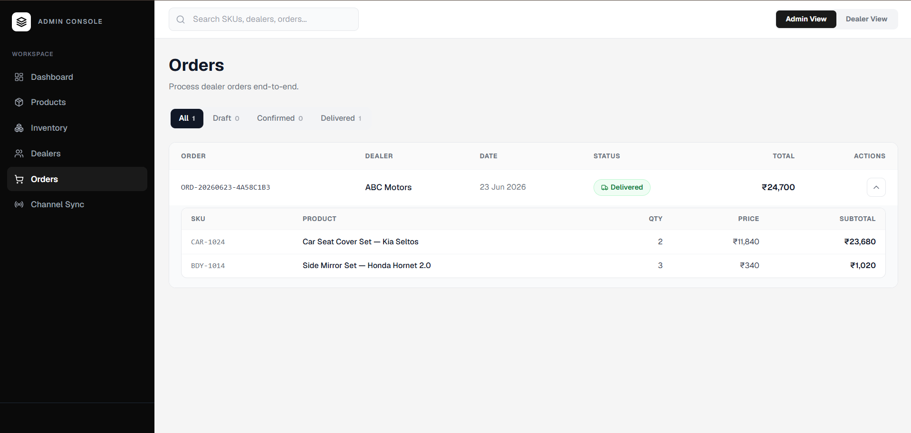
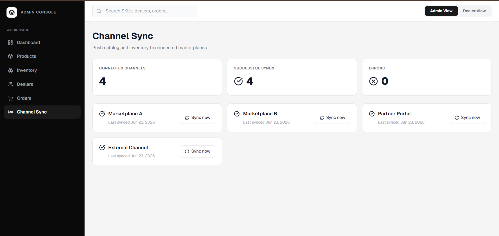
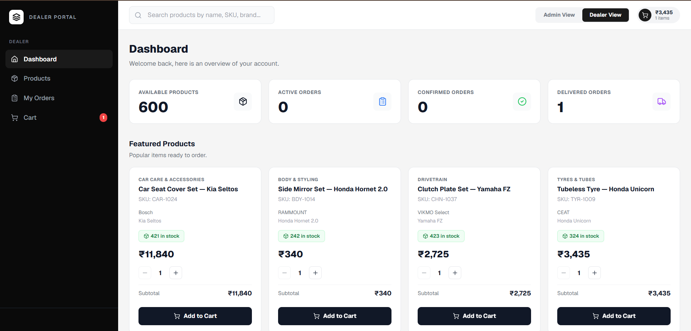
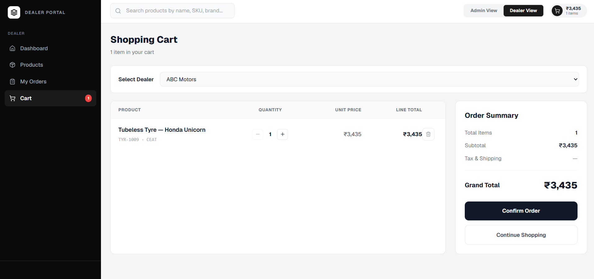
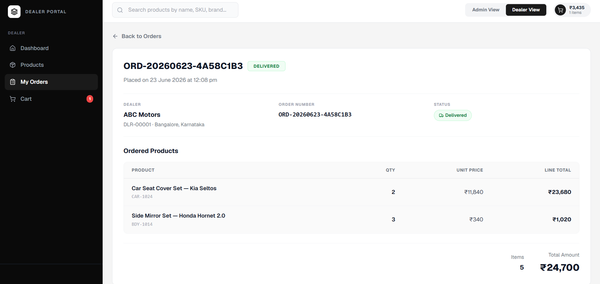

# AutoStore

AutoStore is a web-based Sales Order, Inventory Management, and Channel Sync platform built using Django REST Framework, PostgreSQL, and Next.js.

The application enables administrators to manage products, inventory, dealers, and orders from a centralized dashboard, while dealers can browse products, place orders, track order status, and manage purchasing activities through a dedicated dealer portal.

The platform also includes a Channel Sync module that imports and updates product catalogue data from external sales channels, ensuring inventory and product information remain synchronized across the system.

---

# Application Screenshots

## Admin Dashboard



## Product Management



## Inventory Management



## Dealer Management



## Orders Dashboard




## Channel Sync



## Dealer Product Catalogue



## Shopping Cart



## Dealer Orders



---

# Features

## Product Management

* Create products
* Update products
* Delete products
* Search products using SKU
* Product categorization
* Price management

## Inventory Management

* Real-time inventory tracking
* Manual stock adjustments
* Inventory visibility across the platform
* Automatic stock deduction after order confirmation

## Dealer Management

* Dealer registration
* Dealer information management
* Dealer-specific order history

## Order Management

* Draft orders
* Order confirmation workflow
* Order delivery workflow
* Order status tracking
* Auto-generated order numbers
* Order total calculations

## Stock Validation

* Prevents overselling
* Validates inventory before confirmation
* Atomic stock deduction process
* Maintains stock consistency

## Channel Sync

* Import products from external channel feeds
* Create new products automatically
* Update existing products
* Prevent duplicate records
* Idempotent synchronization

## Dealer Portal

* Browse products
* Search products
* Add products to cart
* Quantity management
* Order placement
* Order tracking

---

# Tech Stack

## Backend

* Python 3.10+
* Django
* Django REST Framework
* PostgreSQL

## Frontend

* Next.js
* React
* TypeScript
* Tailwind CSS

## Tools

* Git
* GitHub
* Postman
* Docker

---

# System Workflow

```text
Admin Creates Product
        ↓
Inventory Available
        ↓
Dealer Browses Products
        ↓
Dealer Adds Items To Cart
        ↓
Dealer Confirms Order
        ↓
Stock Validation
        ↓
Order Confirmed
        ↓
Inventory Deducted
        ↓
Admin Delivers Order
        ↓
Order Status Updated To Delivered
```

---

# Database Models

## Product

Stores product catalogue information including:

* SKU
* Product Name
* Category
* Price
* Brand
* Vehicle Fitment
* Description

## Inventory

Stores stock information for each product.

Each product has exactly one inventory record.

## Dealer

Stores dealer information including:

* Name
* Email
* Phone Number
* Address

## Order

Stores order information including:

* Dealer
* Order Number
* Status
* Total Amount
* Timestamps

## OrderItem

Stores line items within an order including:

* Product
* Quantity
* Unit Price
* Line Total

---

# API Endpoints

## Products

| Method | Endpoint               |
| ------ | ---------------------- |
| GET    | /products/             |
| GET    | /products/{id}/        |
| POST   | /products/add/         |
| PUT    | /products/{id}/update/ |
| DELETE | /products/{id}/delete/ |

## Dealers

| Method | Endpoint              |
| ------ | --------------------- |
| GET    | /dealers/             |
| GET    | /dealers/{id}/        |
| POST   | /dealers/add/         |
| PUT    | /dealers/{id}/update/ |

## Inventory

| Method | Endpoint                        |
| ------ | ------------------------------- |
| GET    | /inventory/                     |
| POST   | /inventory/add/                 |
| PUT    | /inventory/{product_id}/update/ |

## Orders

| Method | Endpoint             |
| ------ | -------------------- |
| GET    | /orders/             |
| GET    | /orders/{id}/        |
| POST   | /orders/add/         |
| PUT    | /orders/{id}/update/ |

## Order Workflow

| Method | Endpoint                    |
| ------ | --------------------------- |
| POST   | /orders/{order_id}/confirm/ |
| POST   | /orders/{order_id}/deliver/ |

## Order Items

| Method | Endpoint          |
| ------ | ----------------- |
| GET    | /order-items/     |
| POST   | /order-items/add/ |

## Channel Sync

| Method | Endpoint       |
| ------ | -------------- |
| POST   | /sync/channel/ |

---

# Setup Instructions

## Clone Repository

```bash
git clone <repository-url>
cd AutoStore
```

## Create Virtual Environment

```bash
python -m venv venv
```

## Activate Virtual Environment

### Windows

```bash
venv\Scripts\activate
```

### Linux / macOS

```bash
source venv/bin/activate
```

## Install Dependencies

```bash
pip install -r requirements.txt
```

## Create Environment Variables

Create a `.env` file in the project root:

```env
DB_USER=<database_username>
DB_PASSWORD=<database_password>
```

## Run Migrations

```bash
python manage.py migrate
```

## Import Catalogue Data

```bash
python manage.py import_catalogue
```

## Run Backend Server

```bash
python manage.py runserver
```

Backend URL:

```text
http://127.0.0.1:8000
```

---

# Frontend Setup

Navigate to frontend directory:

```bash
cd frontend
```

Install dependencies:

```bash
npm install
```

Start development server:

```bash
npm run dev
```

Frontend URL:

```text
http://localhost:3000
```

---

# Sample cURL Requests

## Get Products

```bash
curl http://127.0.0.1:8000/products/
```

## Get Dealers

```bash
curl http://127.0.0.1:8000/dealers/
```

## Get Inventory

```bash
curl http://127.0.0.1:8000/inventory/
```

## Get Orders

```bash
curl http://127.0.0.1:8000/orders/
```

## Confirm Order

```bash
curl -X POST http://127.0.0.1:8000/orders/1/confirm/
```

## Deliver Order

```bash
curl -X POST http://127.0.0.1:8000/orders/1/deliver/
```

## Trigger Channel Sync

```bash
curl -X POST http://127.0.0.1:8000/sync/channel/
```

---

# Assumptions

* Product SKU is unique across the catalogue.
* Each product has a single inventory record.
* Inventory is deducted only when an order is confirmed.
* Confirmed and delivered orders cannot be modified.
* Product pricing is preserved at the time of ordering.
* Inventory adjustments do not affect historical orders.
* Dealer email and phone numbers are unique.

For detailed implementation decisions, refer to **DESIGN.md**.

---

# Project Structure

```text
AutoStore/
│
├── core/
├── frontend/
├── vikmo/
├── catalogue.csv
├── catalogue.json
├── channel_feed.json
├── manage.py
├── requirements.txt
├── Dockerfile
├── README.md
├── DESIGN.md
└── .env.example
```

---

# Bonus Features

* Next.js Frontend
* Dealer Portal
* Admin Dashboard
* Channel Sync Interface
* Product Search
* PostgreSQL Integration
* Docker Configuration

---
